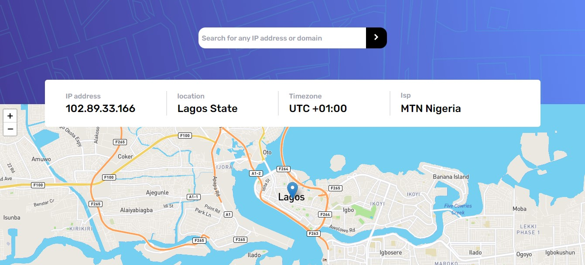

# Frontend Mentor - IP address tracker solution

This is a solution to the [IP address tracker challenge on Frontend Mentor](https://www.frontendmentor.io/challenges/ip-address-tracker-I8-0yYAH0). Frontend Mentor challenges help you improve your coding skills by building realistic projects.

## Table of contents

- [Overview](#overview)
  - [The challenge](#the-challenge)
  - [Screenshot](#screenshot)
  - [Links](#links)
- [My process](#my-process)
  - [Built with](#built-with)
  - [What I learned](#what-i-learned)
  - [Continued development](#continued-development)
  - [Useful resources](#useful-resources)
- [Author](#author)
- [Acknowledgments](#acknowledgments)

## Overview

### The challenge

Users should be able to:

- View the optimal layout for each page depending on their device's screen size
- See hover states for all interactive elements on the page
- See their own IP address on the map on the initial page load
- Search for any IP addresses or domains and see the key information and location

### Screenshot



### Links

- Solution URL: [Add solution URL here](https://github.com/Jasoniyi/ip-tracker-project)
- Live Site URL: [Add live site URL here](https://ip-tracker-project-nm0dbq183-jasoniyi.vercel.app/)

## My process

### Built with

- Flexbox
- Mobile-first workflow
- Tailwind
- [React](https://reactjs.org/) - JS library

### What I learned

I learn't how to use 'calc()' in css and also used this project to practice calling apis and using async await with axios.

```css
.proud-of-this-css {
    min-height: calc(100vh - 15em);
```

### Useful resources

- [Example resource 1](https://stackoverflow.com/questions/19186428/refresh-leaflet-map-map-container-is-already-initialized) - This helped me for using the Map when my Map wasn't showing and it kept giving this error 'refresh leaflet map: map container is already initialized'.

## Author

- Frontend Mentor - [@yourusername](https://www.frontendmentor.io/profile/Jasoniyi)

## Acknowledgments

A hat tip to the fantastic frontend mentor team, you guys are the best, thank you so much!!!
